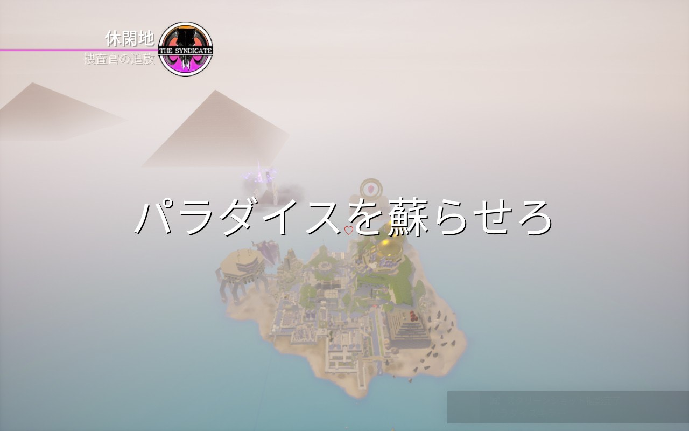
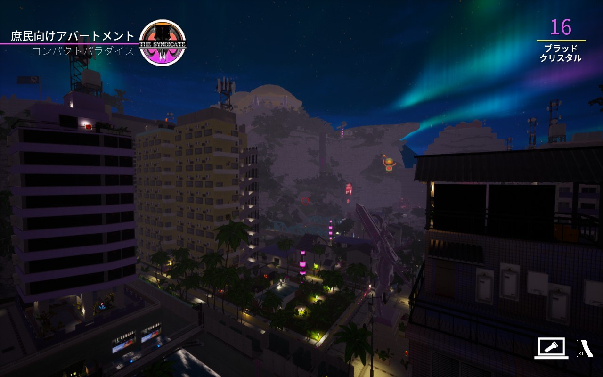
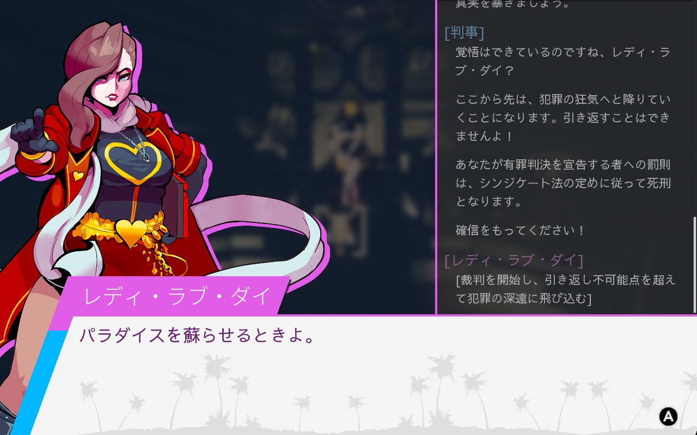
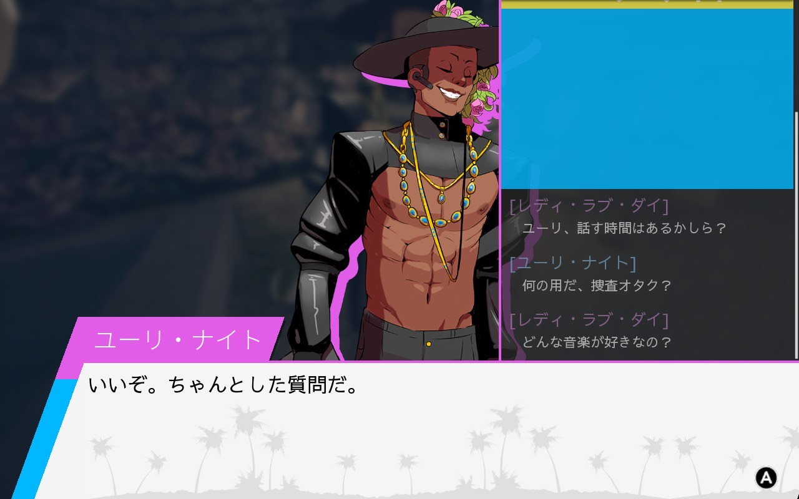
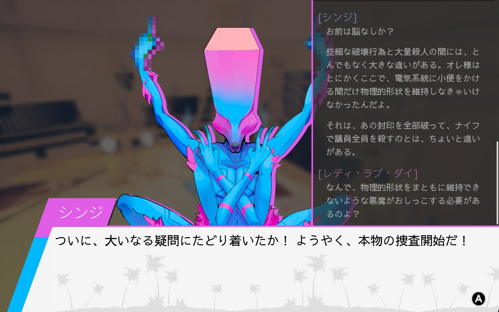
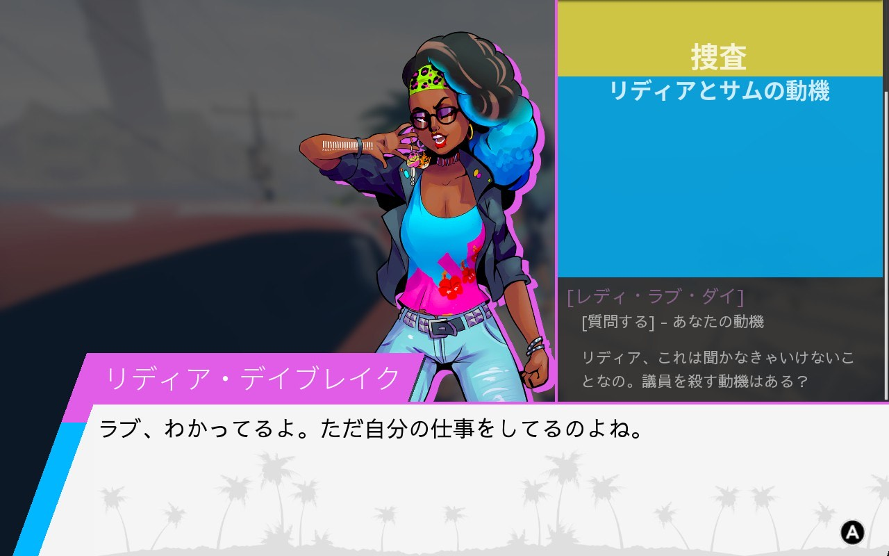
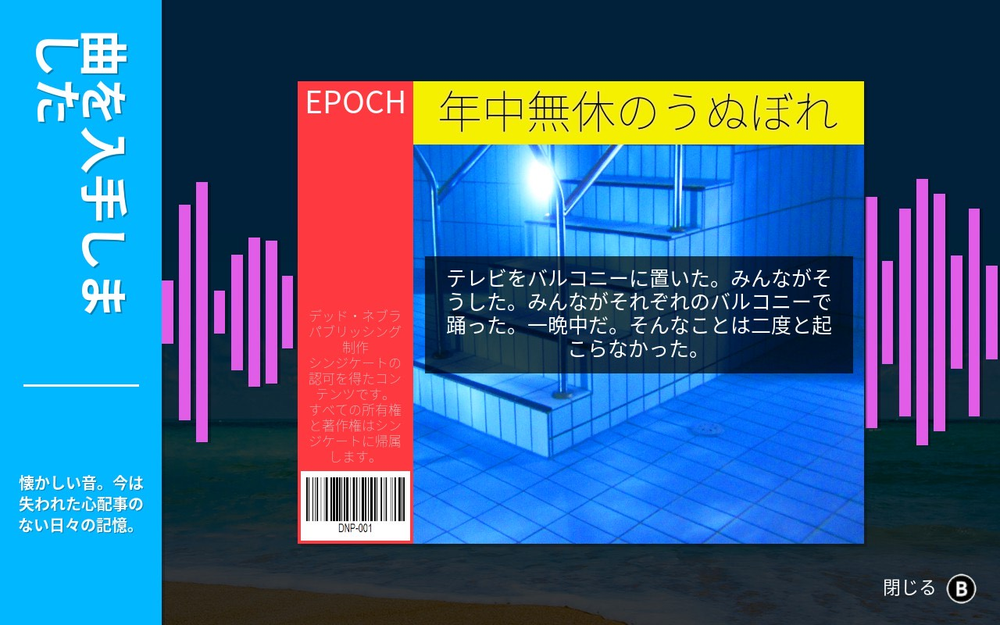
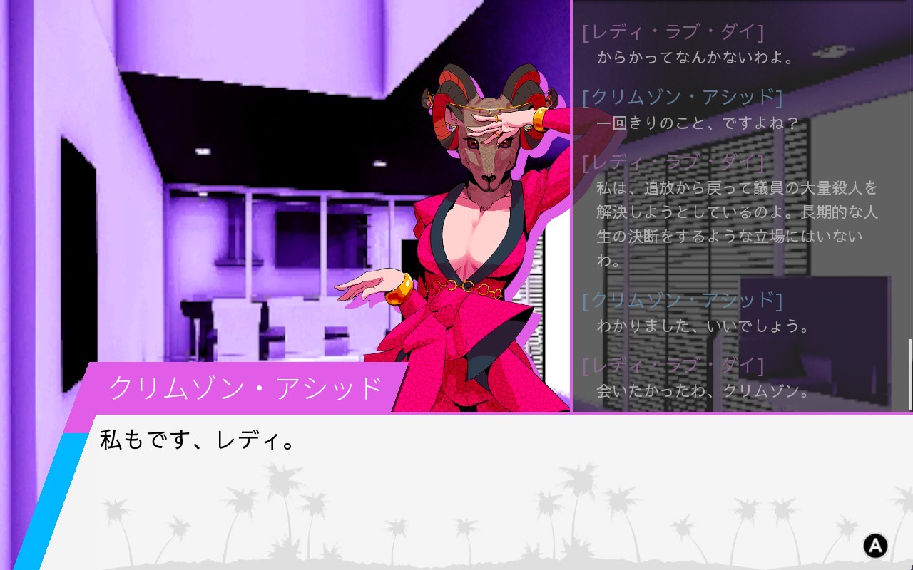
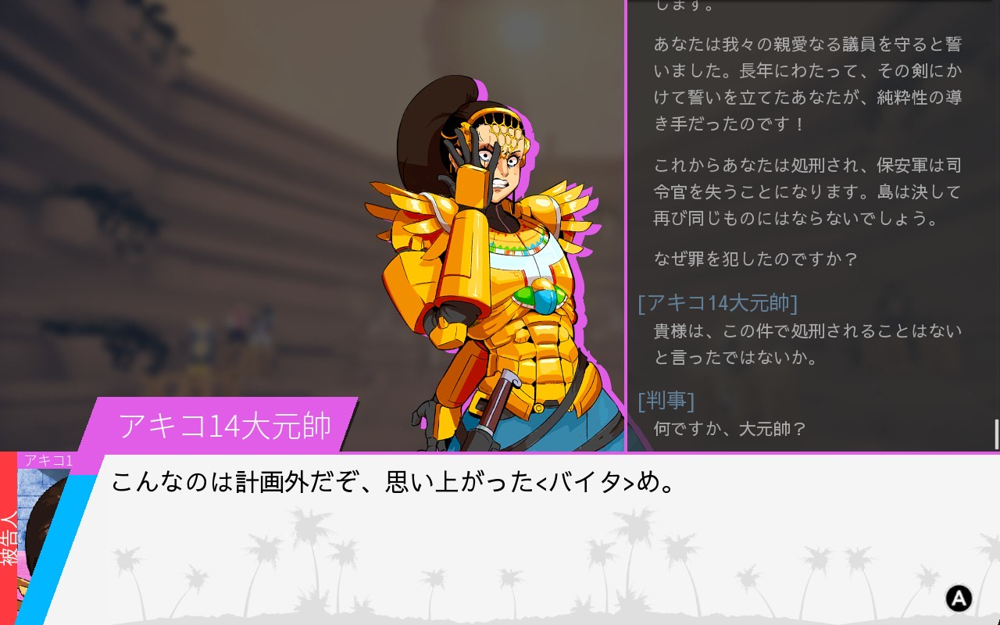
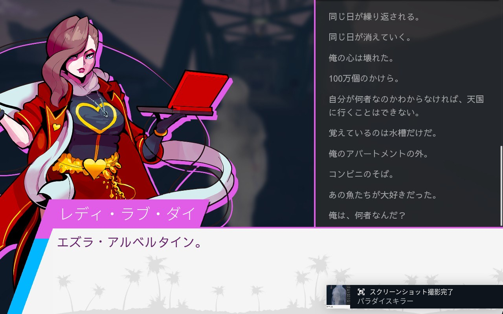

2025/12/29 作成

## 概要
プレイしたのは2025年の3月。 
PCで激酔いして積んでいたが、SteamDeckでは酔わずに無事プレイができたのと、オープンワールドを「Cassette Beasts」で体験したので、いっちょ3Dオープンワールド推理ゲームも行ってみますか！という感じだったが……

## ストーリーかんたん解説

- 完璧なパラダイスを求めて何度も島を作りなおす、人間を超越しつつも神を信仰する団体「シンジゲート」
- 新たな島を作るにはそこで暮らす人間を大量に消費する
- その儀式も終わり、あとは島の移動を待つだけだった
- が、なんと偉い人が儀式中に何人も殺されてしまっていたぜ、しかも、ありえない三つの封印をかいくぐり！！
- こんなことを出来るやつが島に潜んだまま移動なんてできないな
- そこで、かつて追放した捜査オタク「レディ・ラブ・ダイ」に白羽の矢が立った
- さあ、君は帰ってきた捜査官となり、超久しぶりの同僚たちから嫌われたり懐かしまれたりしながら島中を歩き回って真犯人を見つけ出すのだ
- 証拠を集める他にも、やたら個性的な遺留物が集められるよ、雰囲気たっぷりなフレーバーテキストでかつて存在していた住民に思いを馳せつつ、誰もいない団地を駆け抜けて必死で山を登っては真っ逆さまに落下して目的地まで突き進め！！
- なかなか知らない用語と人間関係を圧倒的なテキスト量でワッと浴びせられるゲームなので最初は心配になるが、気づいたら入り込めるので、本当に安心してください、これからやる人よ
- しかし、この記事は若干クリアした人向けなので注意だぜ

## 感想
- 曲良すぎ、あらゆる終わりを表現している、事件が起きようが島にとってはエンディング、だからこそ楽しく、何もかも終わるからこそ賑やかに、もう戻れないからこそ、、最後に思い出したいなんて、誰かの思いがこもったような情景あふれる音楽たち。そんなちょっと切ない雰囲気がだーーーーれもいない住宅街にマッチしている！！
- かつて、たしかにあったはずの喧騒、人々、思い出、パーティー、全てがうまくいった日があったからこそ、あとは最悪な日がずっと続いたっていいと思えるほど、刹那的な良さが詰まった音楽が流れます
- そんな中でVaporwave全開の謎オブジェに集団団地が悪魔合体した日本風な世界を徘徊しまくれるぞ（ビーチやコンビニもあるよ♪）

- まあ、たいへん、高いところから落ちたりしてうまく座標を合わせて金とかアイテムを拾う、難しい。そこはやんなくてもいいんだけど見える収集アイテムが拾えないと気になるよね
- キャラが曲者ぞろいだが、なんだかんだ嫌いな奴はいない
- だからまさか、そんな、こんな、、って感じになる、ラストは。もうだいぶ終盤じゃない？ってとこで見たこともない奴も出てきてびっくりする
- この世界では可能だが普通ではまああり得ない倫理観欠落トリックで大変ドン引き、いや…仰天したぜ！
- ちゃんと調査すれば自分みたいな推理小説で推理できない人間もそこそこ筋道立てて考えることができる、うれしい
- 裁判パートは主人公を100%頼りにできるので、もう分かったわよね？はい！選択肢選ぶプレーヤー「しらねえよ、、」みたいなことは、ない。
- そんでもってプレーヤーもある程度考えはまとめられるので置いてかれることなくノれるはず
- いい感じのみんなの豹変もみれるよ（うちは豹変フェチ！）

- 裁判中はみんなやけくそだ、しかし、まあ、そんな、、って感じの展開にはなります！
- 最後残ったやつらでせめて次の島がんばろーぜ、て思いながら、なんか、でも…こいつ…情報……！！ってアシッド嬢を処刑した時、こんなことしてなにになるんだ（絶望）って思いましたね
- そんで好きなキャラは証人ですかね、せくすぃーなので。
- アキコたんも全然デレてくれなくてかわいいぞお、というか、母国語でずっと罵って来るやべえ奴だけど会話する意思見せれば心も開きかけてくれるし、情も移りやすいらしいので絶対可愛いはずなんだ。ただ本編中はまるで可愛くないのが逆に気になるんだ
- モテているし恋多き女なので、そういう魅力的な一面をこっちも見たいのにラブが嫌われすぎている
- 医者は普通に住民に手を出すけど住民は最後必ず死ぬ、そこに感情がないなんてやはりシンジケートメンバーは人間ではないんだけど、その点アキコは人間味があって…ね
- サムは最初怪しくないのにデッドゾーンで酒作ってるの嫌すぎた
- ユーリは遠目で見たらおかっぱっぽいのに坊主っておまえマジかよ。

- すべてが終わった瞬間、島内放送に不協和音が混ざったり、鳥みたいなものが死んでいて怖かったが、シンジがおしっこしてたのでとても良かった、シンジが1000年単位って言ってくれるまで全然その規模で考えられてなかったよ
- そうです、証拠ラッシュがある程度落ち着いたころ、そろそろ核心に迫ってきたような気がしたんだけど、シンジのちょっとした発言で1000年単位の計画と気づきまして、やっと事件の大がかりさに気づけて震えたよ

- ヘンリーもかわいいのですき、ヘンリーと話してる時だけはナルホドくんになれた気がした。
- ヘンリーめっちゃかばったよ、1の封印はアキコでもヘンリーでもしょうみどっちでもいいが、君には一個も言及しなかったさ、それにしてもこじつけられる材料はしっかり持ってるんだねきみ可哀想に、、

- ズバリいうわよ的な革新突く言葉はザザっとノイズ入って揺れる演出かっこいいです、言ったら相手に負寄りの影響を与えるであろう言葉って現実でもあーいう揺れるような感覚になるよね
- しょうがないけどラブは感情度外視して嫌われるようなことばっかり聞かなければいけなくて、そこを分かってくれるリディアとかほんと優しくて泣けるし変なこと聞いてすまんすぎるって思いました

- 最初に思うのは、ラブがうっすら嫌われすぎていて医者とか会話できる人と話すと癒されすぎるということ！
- それでもズケズケいかなければいかないし、言わない方が良かったなって会話も全然ある！善意を裏切ってごめんなさい！！いろんな思いがありつつ、宇宙の終焉より爽快。
- ひとつ言うとしたら音楽のフレーバーが読み返せないのはもったいないぜ、ただ聴くよりも確実に印象に残る、センス抜群のフレーバーテキストがどの曲にもついていますからこれはマストでスクショするべし！
- 明るいメロディに終わりの切なさを感じさせるテキストは終末を歩き回るのにぴったりさ

- とにかく音楽の良さでプレイのモチベはかなり上がり続けていましたが、クリア後の余韻もなかなかありましたね
- いやー死んだな人がたくさん、、誰からも、友人にとってさえラブの帰還は望まれなかったのか？全て分かったことは公表しないといけないのか？
- 医者は本当に怪しくないし、医者は心から歓迎してくれた。アシッド嬢は、悲恋、、（追放エンドなので、なぜ追放しなきゃいけないんだ）

- みんな動機はそれか。すぎてどんだけ話し合いで解決できない議会なんだよと、議会に問題あり！カルメはまだなんとかなりそうだったじゃん、、証人はこわれていますが
- アキコすきですが、それ以上に豹変したときの正直暴露っぷりが面白すぎる、でも死ななくていい、本当に。

- 正直、メンバーをこれだけ失ったシンジケートはこれからどうするのという気持ち、、！！
- 愛着はみんなに湧いてますよ、なんども歩いて通っては、質問に答えてくんない困った奴らばっかだったけど、かわいいやつらだったさ、、（このゲームはファストトラベルが気軽に使えないのですが、それが体験としてよかったのかもしれません）
- 楽しいゲームだった、探索できる場所はどんどん増えるしどこも見たこともないワクワクする場所ばかり、不気味な面もあるけど側から見たこの島の異常さは意外と言及されたり無視されてないのが安心する
- 好きなシーンは病んでる幽霊にズバッと名前を教えるところ、プレイヤーが操作するでもないラブの証拠記憶の正確さが捜査オタクらしくてかっこいい

- はあ、またあの音楽の中で、歩き回りたいなあ、音楽、最高です、このゲームは。！！！！最高！！！！
- Spotifyでサントラ聴けるんだけど、そこで曲名の和訳がかなりイカしていたことに気づく
- 「Ego24-7」を「年中無休のうぬぼれ」と訳すセンスに駄々惚れです
- 実績は加速する正義とかがちょろっと残っているので、ヘンリーを処刑したくなったらやるかも、やらないかも
- 真実を知ってそれをどうするかは実績にまったく含まれておらず、自分だけの真実を作り出せという制作陣のおもいを感じるぜ
- 自分のプレイでは可哀そうなぐらいユーリとアキコを追いつめたけど、結局どうやっても夫婦には合流してしまうんだなあ…ていう、夫婦の運命がアシッド嬢を追放した理由かもしれません……
