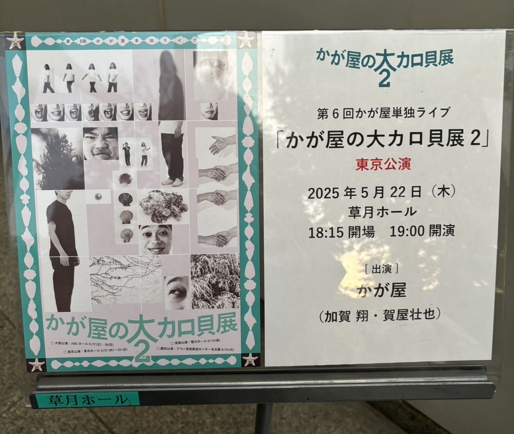
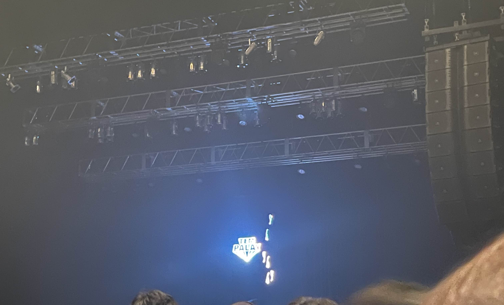

2025/12/29 作成

## 通算

今年行ったライブは4回でした。

## 年表

### 2025/5/22(木)19:00 第６回かが屋単独ライブ『かが屋の大カロ貝展２』

- めちゃくちゃ笑える、というよりは、のっぴきならない人生の短編集
- これを書いているのは12月だが、「決戦は金曜日」が掛かっていたことは鮮明に思い出せる
- コント一本ごとに、始まる前に曲＋タイトルがゆっくり横に流れていくのだが、この演出がめちゃ好きだ
- どんなコントが始まるんだ…というワクワク感と、終わってみればなるほどね感が、三度美味しい

### 2025/8/9(土)15:30 ななまざり　－囲碁将棋混入－

- ダブルインパクト後というのもあり、見る側もななまがり熱がちょうど高まっていた
- ビキニのネタに囲碁将棋が混入し、最終的に撮影会となり終演した
- 囲碁将棋はコンビニのネタをやっていてそこのヤバイ客としてななまがりが混入していた
- 確か、森下の細かい気づかいによって、めちゃくちゃなアドリブでも上手く話がまとまって無事ネタが終われた記憶
- 見たネタの中ではグリーンチャムが一番好きだ、ハッピー度が高いネタで、口に出して言いたくなる名前は一度聞いたら染みつくぜ

### 2025/11/5(水)19:00 Tempalay ”Naked 4 Satan” Tour 2025

- 初めてTempalayのライブに行った！なぜなら今年から聴いているから！
- 一番聴いているゴーストアルバムから「Odyssey」がスーパーロングバージョンでやってきた
- あの段々増える音がライブだとこれも、それも増やしてリズムも取っちゃったりして、ウヒョー！って感じになっておりました
- そのあとは、イメージ通りグリーンな照明で動物界、いい流れだァ。。
- 場所的にまったくステージは見えなかったのですが、それでも全然よかった
- 一発目から「かみんち」でしたが、そこで真横に小原さんの影だけ見えたのが印象的（そういう瞬間があったのです）
- 「とん」でようこそーが入って、惑星Xの映像で見たやつだ！ってなった

### 2025/12/08(月)19:30 CRCK/LCKS 2nd Album「まにまに」release tour 2025

- サイコゥ！サイコゥ！サイコゥ！
- クラクラのライブも初めてだけど、以前土岐麻子さんのライブで小西さんを見たから初めてな感じはしない！
- いや～～～～、まにまにツアーなのにまにまにを通しで聴いたのは一回ぐらいだったんですよ
- 今は毎日、一日一回は通しで聴いていますね
- 破壊と再生、一時の平穏、続く穏やかさ、ひび割れ破壊された物も全ていずれは元に戻るという、そんな心の安寧を・・・
- インパクトがすごかった、MC→「あらわらわ」→「つまらない毎日」がぶっちぎってイカレてた、どういうことではない、本当に
- ロングな「T.I.C」もジャングルみたいでめっちゃかっこよかったまた聴きたい
- MCもメンバーの人柄と歴史を感じるものでよりクラクラを好きになれて大満足
- 意識を旅させる、小田さんから聞いたこのテーマを胸にたくさん聴きます、まにまにまにまに、何度でも繰り返す…