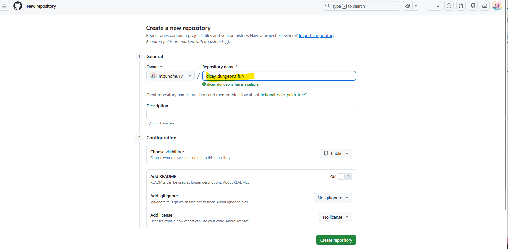
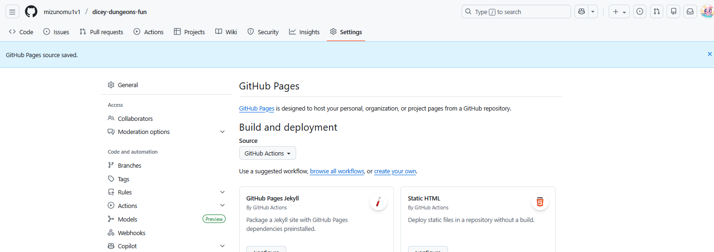
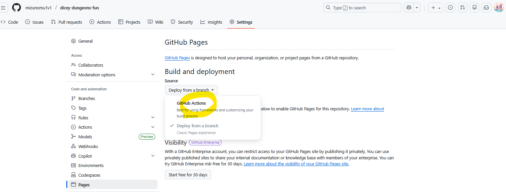
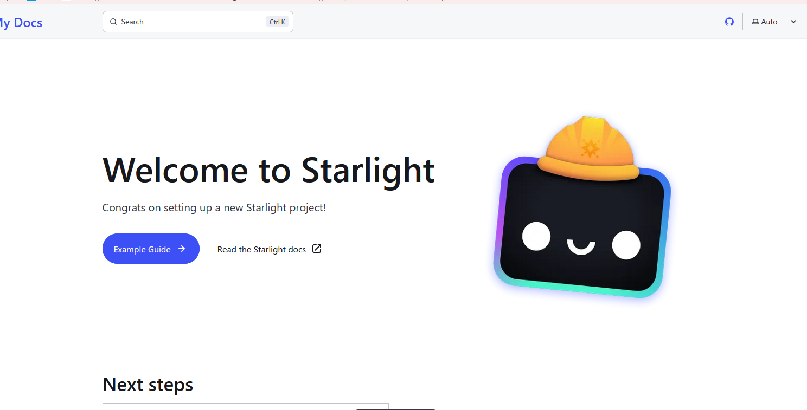
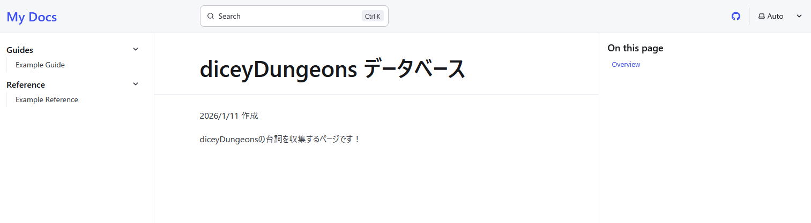
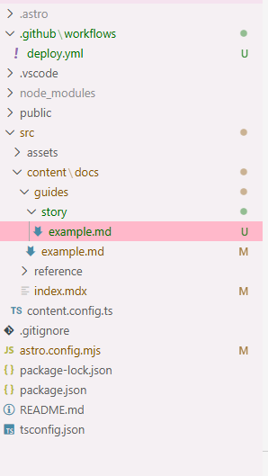
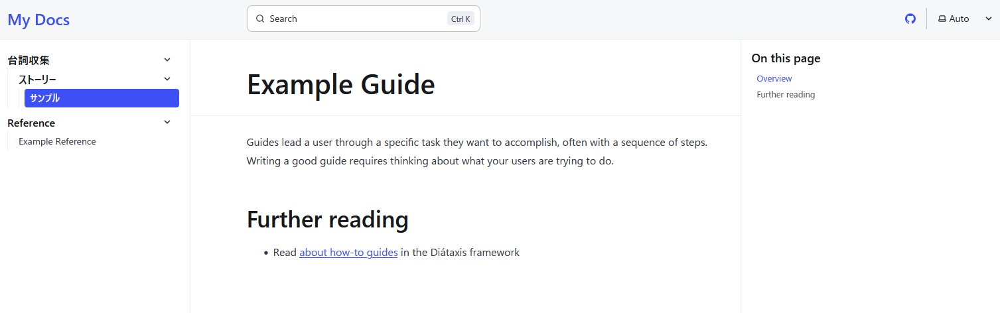
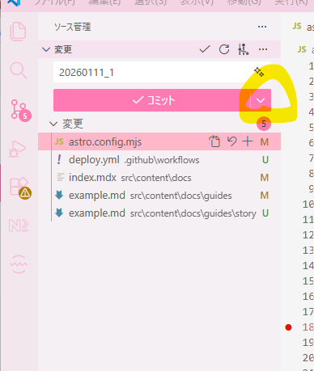
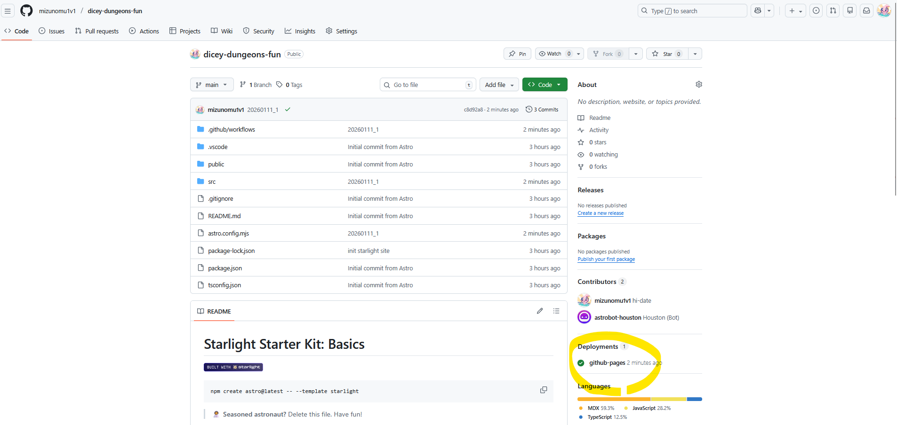

2025/12/29 作成

## はじめに

気軽にマークダウンでいい感じのテキストサイトを作りたくなり調べてみたが、ピッタリな仕組みがあるらしい！Astro / Starlightってのを使うみたいだが…なんかよくわからないけど、やってよう！！

### 全体の流れ

- npmコマンドを使って、Astro / Starlightをインストール
- そしたらVSCodeを使ってテキストファイルをMarkdown書式で書こう
- ある程度書けたらGitHubにアップロード
- それだけで、ネットの海にテキストサイトが公開できるのだ！

### 作成イメージ
- 公式のドキュメントがAstro / Starlightを使用しているので、見てみるとイメージしやすい https://starlight.astro.build/getting-started/
- フォルダ名がサイドバーの表示カテゴリ名となり、Markdownファイルが個々のページとなる

## (1) 環境準備
今回はWindows環境を前提に進めるぜ、必要になるのは以下！<br>
入ってない人は公式サイトからインストールだ。

- **Node.js**：
  - JavaScriptをブラウザの外で動かすための土台、今回はAstro / Starlightを動かすエンジンとして使うだけなので、あまり意識せずインストールすればOK
- **npm**：
  - Node.jsをインストールするとターミナルで使えるようになるコマンド。Astro / Starlightを取得するのに使う
- **Git**：
  - ソースコードやテキストファイルを管理するツール、アカウント作成が必要
- **GitHub**：
  - アップロードしたファイルをネット上に公開したり、取得できるサービス。今回はアップロードを通してサイトの公開まで行うぞ
- **VSCode**：
  - テキストエディタ、Markdown書式とGitと相性がいいのでぜひ使おう

環境準備というが、この時点ではAstro / Starlight はまだ入っていない。

### Astro / Starlighとはなんぞや？

これから使う「Astro / Starlight」が何者なのかを今のうちに整理しておく。<br>
- **Astro** ：
  - テキストファイル（Markdownなど）を元にして、Webサイトの形（HTML）を作ってくれるツール
- **Starlight** ：
  - Astroで作ったHTMLをいい感じのデザインやら機能性を追加してくれるツール

## (2)作業フォルダを作ろう
早速素敵な日記ファイルを作りたいものだが、ファイルを置く場所がまず必要。<br>
とはいえ難しいものではなく、単純に作業スペースとなるフォルダを作成すればOK<br>
ただ、最終的にGithubにアップロードする元ネタフォルダにもなるので意外と大切な工程だ！<br>
私はこの手順で大好きなゲーム「diceyDungeons」のファンサイトを作ってみようと思います

- ここからのコマンドは、VSCodeのターミナルで打ち込むべし
```bash
# 作業用フォルダを作成しよう
# 例）Documents 配下に作りたい場合は、まずそこまでcdコマンドで移動する
cd C:\Users\ユーザー名\Documents

# Astro + Starlight のプロジェクトを作成しよう、何か聞かれたらYesでOK
npm create astro@latest -- --template starlight dicey-dungeons-fun
cd dicey-dungeons-fun
```

### コマンド解説

`npm create astro@latest -- --template starlight dicey-dungeons-fun`を実行すると、Astro / Starlight を使ったテキストサイトのひな形が、まるごと1セットで作られるぞ。<br>
- まず`npm create astro@latest`で、npm に対して「Astroの最新版を使ってプロジェクトを1つ作りたい」という意思表示
- `--template starlight`で「普通のAstroではなくStarlight用に用意された形でプロジェクトを作ってほしい」と指定する
- `dicey-dungeons-fun`は作られるフォルダの名前でありプロジェクト名なので、任意の名前でOK！
- 今作ったフォルダの中でこれから作業する必要があるので、cdコマンドで`dicey-dungeons-fun`の中に移動するのだ
<br>

## (4)必要な部品を入れよう
`dicey-dungeons-fun`の中に、プロジェクトがを動かすために必要な部品を丸ごとインストールしよう。
- インストールの結果、`node_modules`というそれなりに大きいフォルダができるが、特に意識しなくてOK
- VSCode上で`dicey-dungeons-fun`を開きつつ、やはりターミナルで作業するのだ
```bash
# プロジェクトがを動かすために必要な部品を丸ごとインストール
npm install
```

## (5)いざ、ローカル起動！

```bash
# ローカル起動
npm run dev
```

ローカル起動すると、ターミナルにこんなのが表示されるはず（URLは例）
```bush
┃ Local    http://localhost:4322/
┃ Network  use --host to expose
```
LocalのURLにアクセスできれば、まずはOK！

## (6)GitHubリポジトリ作成

- あらかじめGitHubで空リポジトリを作っておこう
- スクショのように、先ほど作ったフォルダと同名にして、他は何も入力せず緑ボタン押下でOK


- こんな画面になるよ

## (6)初回push
`dicey-dungeons-fun`上で新しいターミナルを開いて、以下の要領でgitコマンドを打っていけば準備完了
```git
# ローカルファイルに対してGitの管理対象フォルダ宣言を行う
git init

# 今あるファイル全部を次のコミットに含める宣言を行う
git add .

# 初回コミット
git commit -m "init starlight site"
git branch -M main

# GitHubのURLをremoteに登録
git remote add origin https://github.com/mizunomu1v1/dicey-dungeons-fun.git

# pushする！
git push -u origin main
```

## (7)設定ファイルでURLを調整だ
- `dicey-dungeons-fun`の中に`astro.config.mjs`というプロジェクト全体の設定ファイルがある
- まずは、URLを独自サイト用にカスタムしよう
- `export default defineConfig({`の下に、二行足せばOK
```
export default defineConfig({
    site: 'https://mizunomu1v1.github.io/dicey-dungeons-fun/',
    base: '/adicey-dungeons-fun/',
```
- ここを変えた時点で元のURLは404になる
- 次からは http://localhost:4322/dicey-dungeons-fun/ で開こう

## (8)自動デプロイを設定しよう
今時点で、ローカルではサイトが見られるようになっているので…次は、GitHubにpushしたタイミングで自動でサイトが公開＆更新される仕組みを作るぞ！といっても、ちょっと設定を入れるだけなのでとってもカンタン。

### GitHub Actionsの設定
- ファイルがGitHubにpushされるたびに、MarkDownファイルがHTMLに変換されて、GitHub Pagesにアップロードまでしてもらえる仕組み
- ファイル`.github/workflows/deploy.yml`を作成するだけでOK
- 中身は公式ガイド https://docs.astro.build/en/guides/deploy/github/?utm_source=chatgpt.com をそのままコピペで問題なし

### GitHub側の設定

- GitHubのリポジトリ画面でSettings → Pages → Source を「GitHub Actions」に変更する

ここまでやればOK！！

## (9)サイドバーを作る

- ところで、サイトが開けたと言いつつ、画面はまだデフォルト状態のはず
- 今表示されているのは`dicey-dungeons-fun\src\content\docs\index.mdx`
- ここを丸ごと消して、例えば以下に差し替えると…
```
---
title: diceyDungeons データベース
---
2026/1/11 作成

diceyDungeonsの台詞を収集するページです！
```

- サイドバー、爆誕！！

## (10)カテゴリ整備
- デフォルトで作られている`Guides`を改造しながらカテゴリを作ってみる
- サイドバーに表示されている「Guides」の出どころは設定ファイルの`astro.config.mjs`の以下
```
			sidebar: [
				{
					label: 'Guides',
```
- ここを以下に変えてみる
```
			sidebar: [
				{
					label: '台詞収集',
```
- サイドバーに表示されている「Guides」が「台詞収集」に変わる

## (11)カテゴリをもう一階層深くする
- `guides`の配下に`story`フォルダを作成してみる
- `astro.config.mjs`に以下に書き換える
```
			sidebar: [
				{
					label: '台詞収集',
					items: [
						{ label: 'ストーリー', autogenerate: { directory: 'guides/story' } },
					], 
				},
```
- ついでに、`story`フォルダ配下に`example.md`をコピーして入れてみよう

- `example.md`のヘッダはほぼいじらず、サイドバーに表示したいラベルだけ変えてみる
```
---
title: Example Guide
description: A guide in my new Starlight docs site.
sidebar:
  label: "サンプル"
---
```

- ある程度のひな形が完成だ！

## (12)公開する
- ここまでやってきたが、まだローカル起動のままなので、そろそろネットに公開してみよう！
- 先ほど自動デプロイの設定をしたので、公開するのに必要なのはpushのみ
- VSCodeのgitタブを開いて、以下を押下＞コミットして同期

- (6)で作ったページを今見ると、こんな感じになっているはず

- 「github-pages 3 minutes ago」は三分前にデプロイ終わったよん、的な意味なので、迷わずクリック
- https://mizunomu1v1.github.io/dicey-dungeons-fun/ 的なリンクが表示されるのでそこもクリックすれば、ブラウザ上で確認が行えるぞ！